# Self-Driving Car Engineer Nanodegree
# Computer Vision
## Project: Vehicle detection by training a Machine-Learning classifier

### Overview
This is the 5th project of the <a href="https://www.udacity.com/course/self-driving-car-engineer-nanodegree--nd013">Self Driving Car Engineer Nanodegree</a> I am taking part. <br>
The aim of this project was to train a classifier (in this case, a Linear SVM) to detect vehicle base on a video stream from a camera mounted on the hood of a car. 

### Data collection
Here are links to the labeled data for [vehicle](https://s3.amazonaws.com/udacity-sdc/Vehicle_Tracking/vehicles.zip) and [non-vehicle](https://s3.amazonaws.com/udacity-sdc/Vehicle_Tracking/non-vehicles.zip) examples that has been chosen to train the classifier.  These example images come from a combination of the [GTI vehicle image database](http://www.gti.ssr.upm.es/data/Vehicle_database.html), the [KITTI vision benchmark suite](http://www.cvlibs.net/datasets/kitti/), and examples extracted from the project video itself.

### Pipeline
The following steps have been applied to each frame of the video stream in order to detect the vehicle(s):

* Apply a color transform from RGB to YUV to the image.
* Perform a Histogram of Oriented Gradients (HOG) feature extraction on the labeled training set of images.
* Normalize the extracted features. 
* Train the classifier
* Implement a sliding-window technique and use the trained classifier to search for vehicles in image.
* Create a heat map of recurring detections frame by frame to reject outliers and follow detected vehicle(s).
* Estimate a bounding box for vehicle(s) detected.
* Output this bounding box around the vehicle(s).

### Step details

* Apply a color transform from RGB to YUV to the image. <br>
To decide which color space I was going to use, I run the trained classifier on the same image with different color space: <br>
  * RGB color space
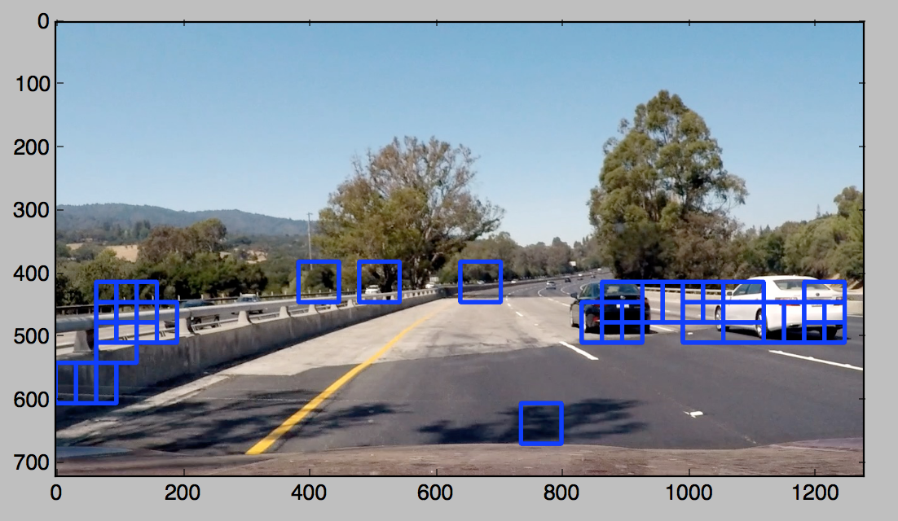
  * YUV color space
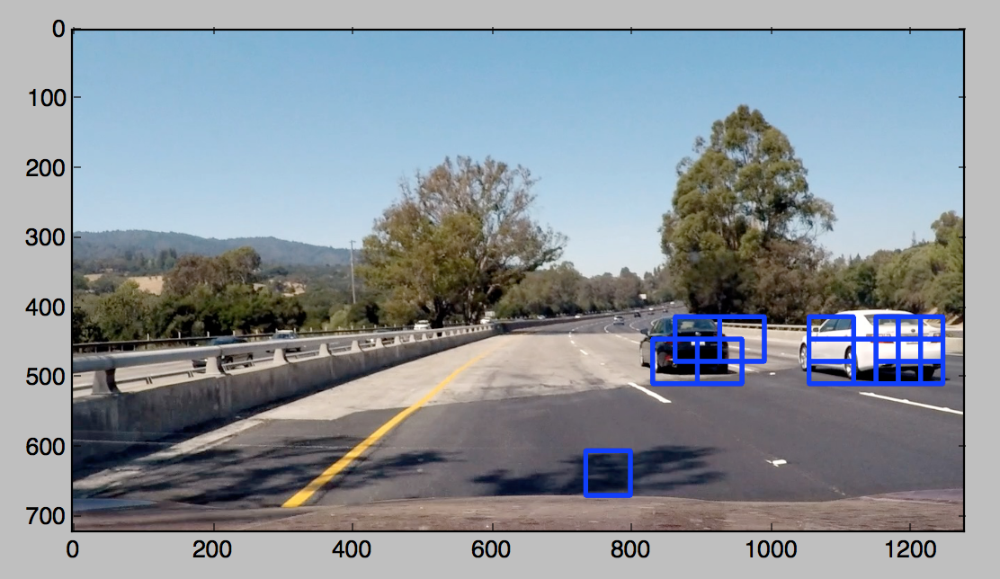
  * HSV color space
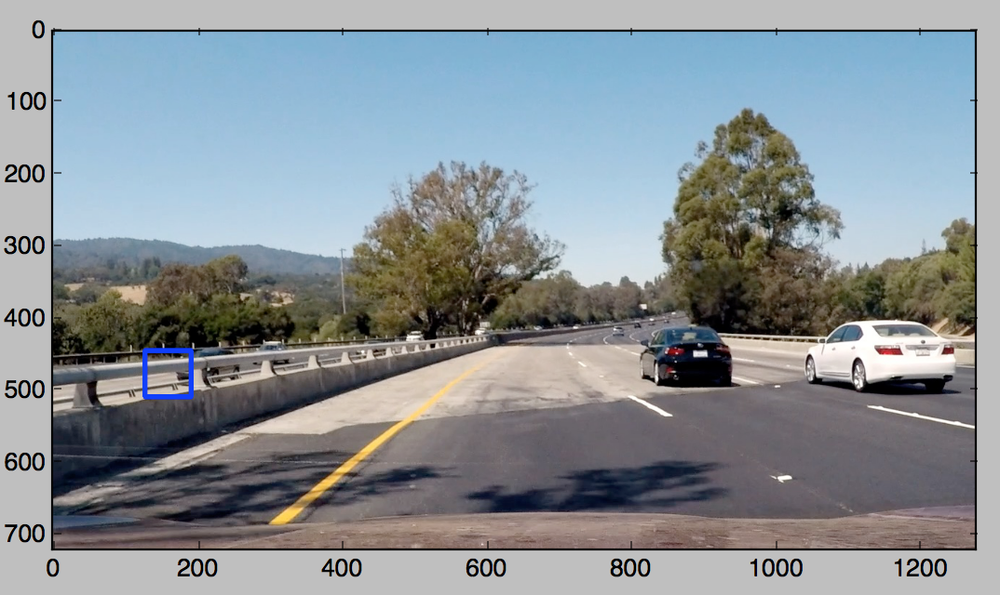
  * Lab color space
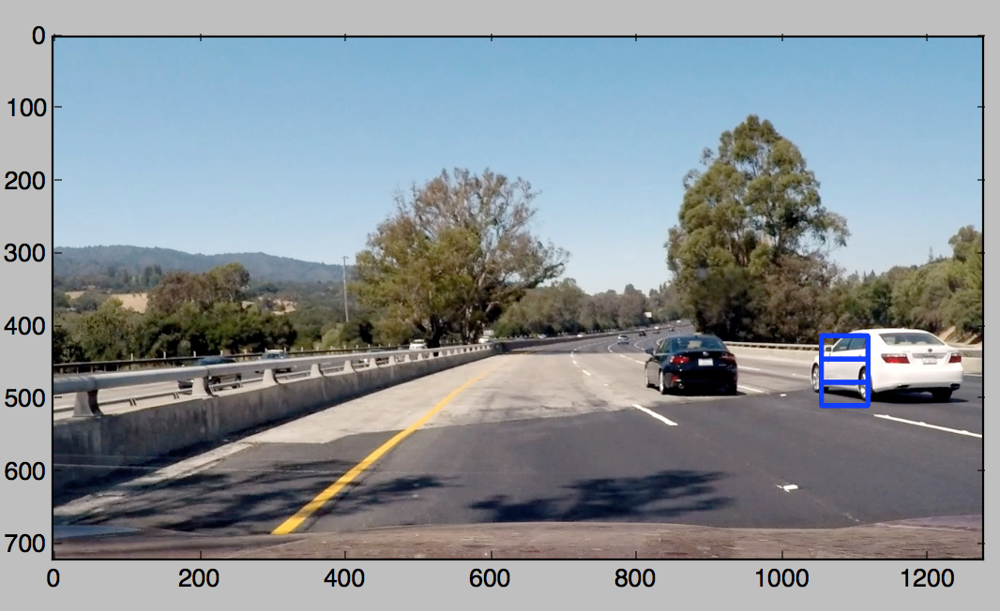
  * LUV color space
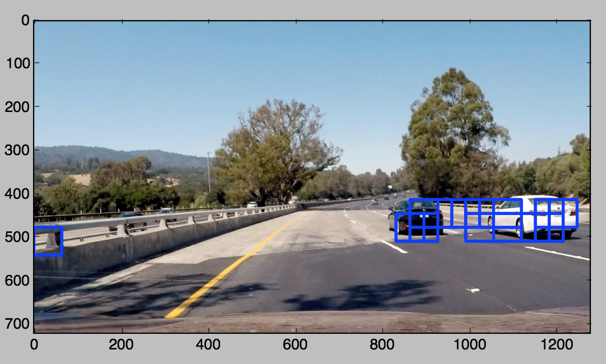
  * YCrCb color space
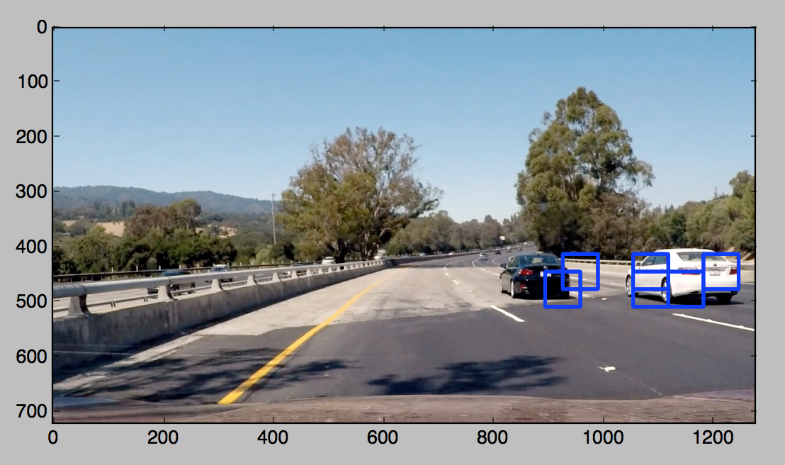


Here, we can see that the YUV, YCrCb and LUV color space all did a pretyy good job identifying the 2 cars. However. YCrCb is the only one to distinctively detect them, but YUV draw more boxes arounf the actual car which will be useful when it comes to detect false-positives with the Heatmap. It is the color-space I am going to use here. 

* Perform a Histogram of Oriented Gradients (HOG) feature extraction on the labeled training set of images. <br>
The HOG features of a particular image has been chosen to identify a car. This [paper](http://lear.inrialpes.fr/people/triggs/pubs/Dalal-cvpr05.pdf) served as a starting point. <br/>
The HOG feature can be applied on each of the channel from a givem image. For comparison, here are some samples I computed to base the choice on which color space I was going to use: <br/>
  * HOG applied to RGB channels
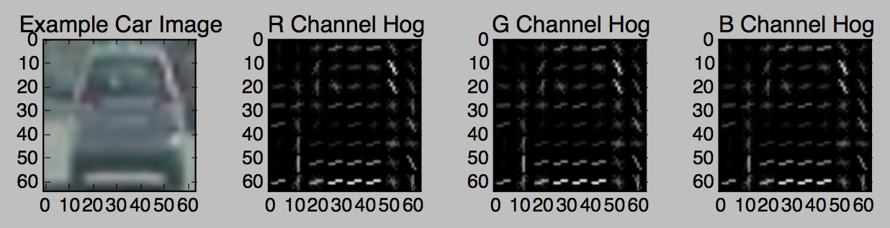
  * HOG applied to YUV channels
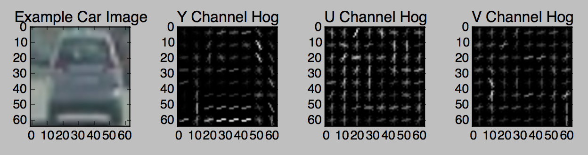
  * HOG applied to HLS channels
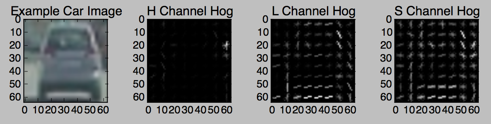
  * HOG applied to HSV channels
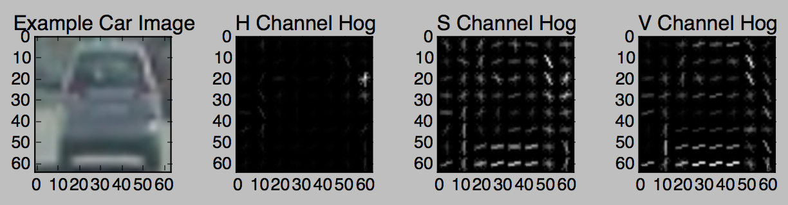
  * HOG applied to Lab channels
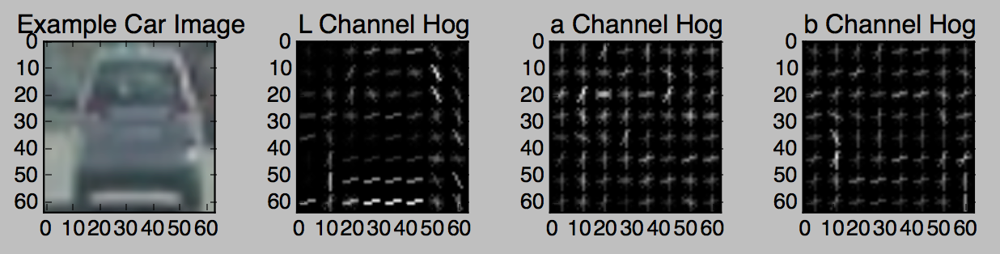
  * HOG applied to LUV channels
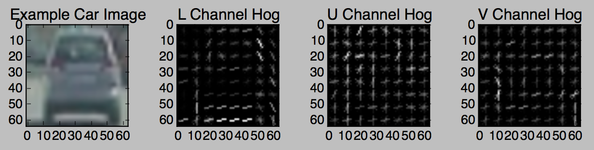
  * HOG applied to YCrCb channels
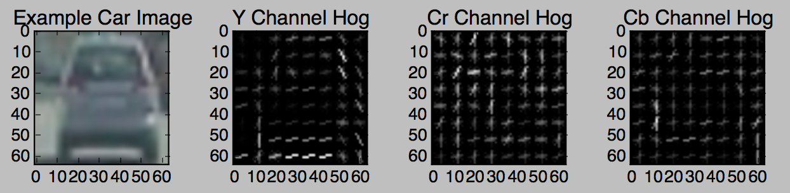


From the images above, we can see that YUV or YcrCb are good candidates for the color to use. Indeed, each of the channels display enough data to discriminate a car among other objects.

* Normalize the extracted features. <br>
Like in any Machine-Learning algorithms, it is immportant to normalize the features of the inputs (here the vector representing the HOG features of each channel of the image). By doing this, we avoid giving too much weight to certain parameters. Here is a comparison between not-normalized and normalized feature from a random vehicle image of the dataset: <br/>
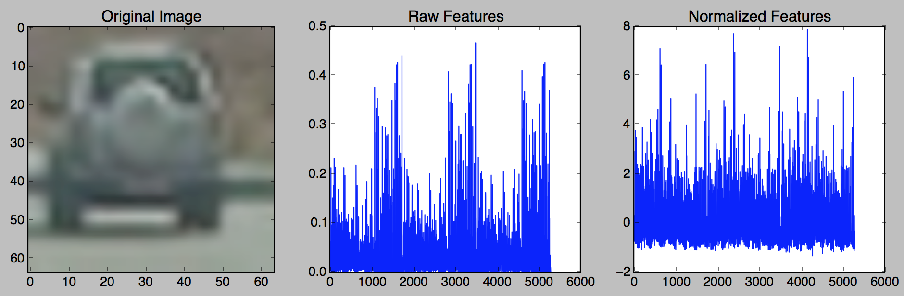

* Train the classifier. <br>
Before training the classifier, the dataset has been splitted into training and test set. Doing this, I can safely the the accuracy of the classifier on the test set. I obtain more than 99%. 
```
from sklearn.svm import LinearSVC
svc = LinearSVC()
svc.fit(X_train, y_train)
```

* Implement a sliding-window technique and use the trained classifier to search for vehicles in image. <br>
A window from a defined size will <i>slide</i> to a defined zone of the frame, looking for vehicles. Here, it is not necessary to look for a vehicle above half of the size of the input images, since it's the sky (in the future, may be there will be some cars there too). We can also see that the vehicle on which the camera is is always driving on the left lane of the road. We can then assume that the vehicle will be detected on the right side of the image. 

* Create a heat map of recurring detections frame by frame to reject outliers and follow detected vehicle(s). <br>
It is possible that several boxes are drawn around th vehicle. It is for example the case where a vehicle is detected inside another vehicle. The classifier being not perfect, it can also detect vehicle where the is in fact notthing. These multi-boxes and false-positives detection can be eliminated using a heatmap. Practically, I will weighten all pixels within the boxes detected around the vehicle, then take the centroid of it, and draw a new box around. An example of a heatmap can be seen here: <br>
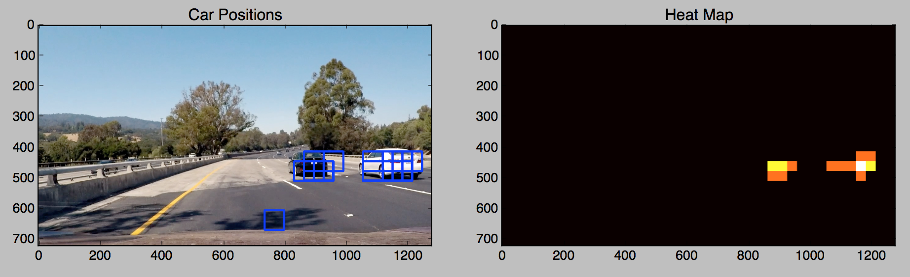

* Output this bounding box around the vehicle(s). <br>
The final result of the pipeline can be see in the following image: 
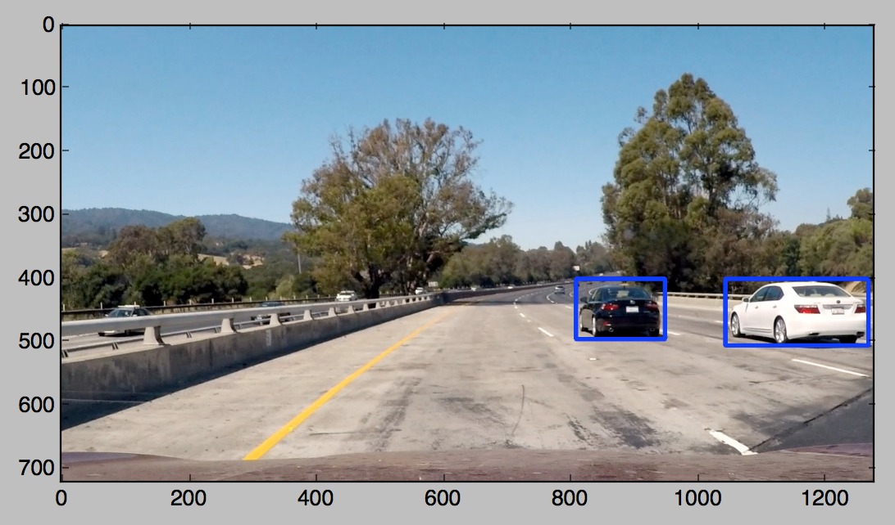


###Discussion

First of all, I only check on one part of the frame (the right bottom part), because in this case, the car on which the camera is mounted always drive to the left lane. We could enhanced this by searching a car within the whole half bottom part of the image. This way, the detection of vehicle will not be dependent anymore from the position of the car on which the camera is. <br>
SVM is a ggod classifier, but we need to provide it labeled data. In this project, I extract some features from the image (HOG, color space etc...) to train the classifier, and it was difficult to find the right parameters to get a great precision. What I could d is to use a Deep Convulotionnal Network to better detect cars. Indeed, Convolutionals Layers are able to detect shape by itself, removing the need to extract features before procesing the images.