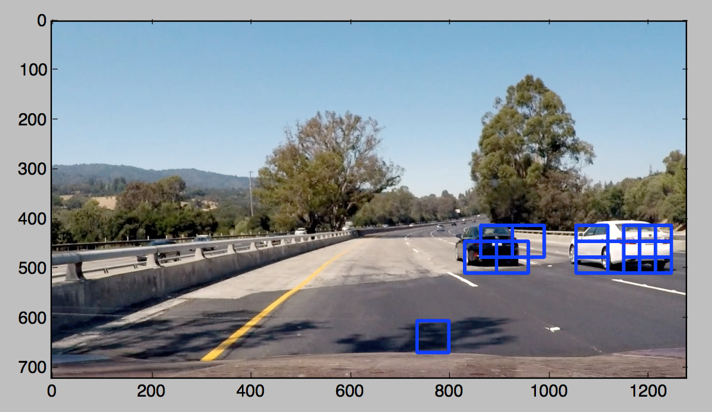
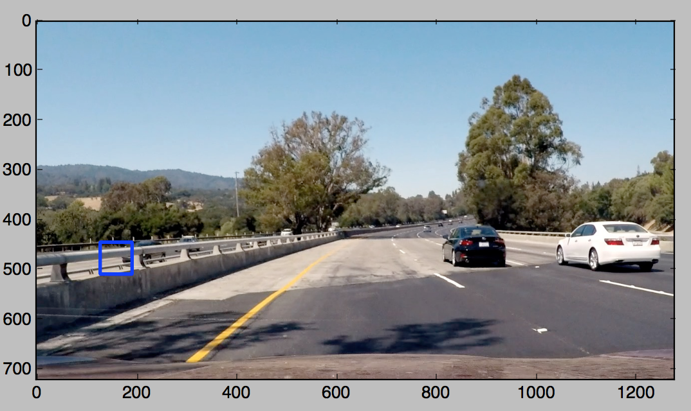
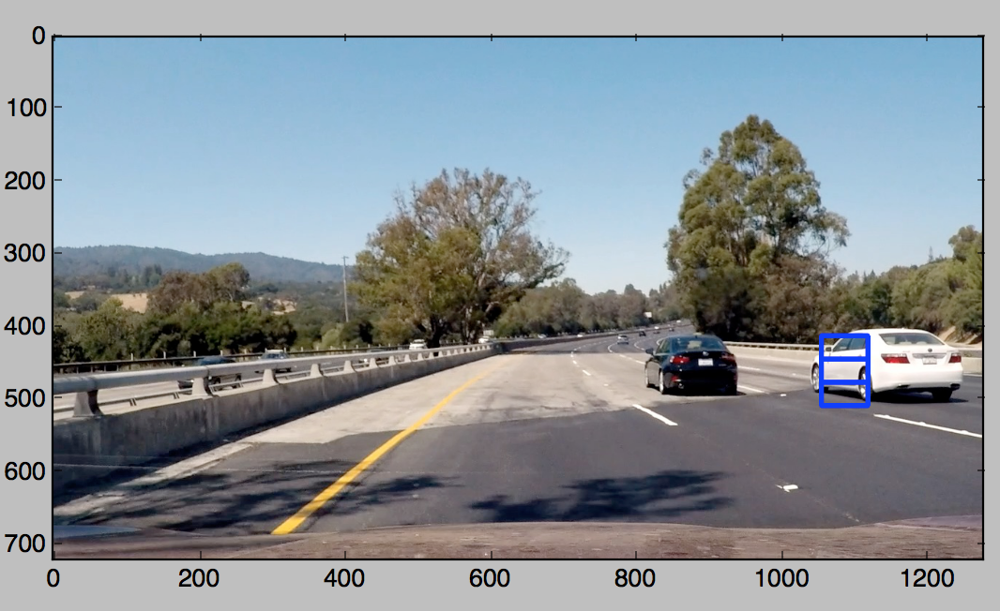
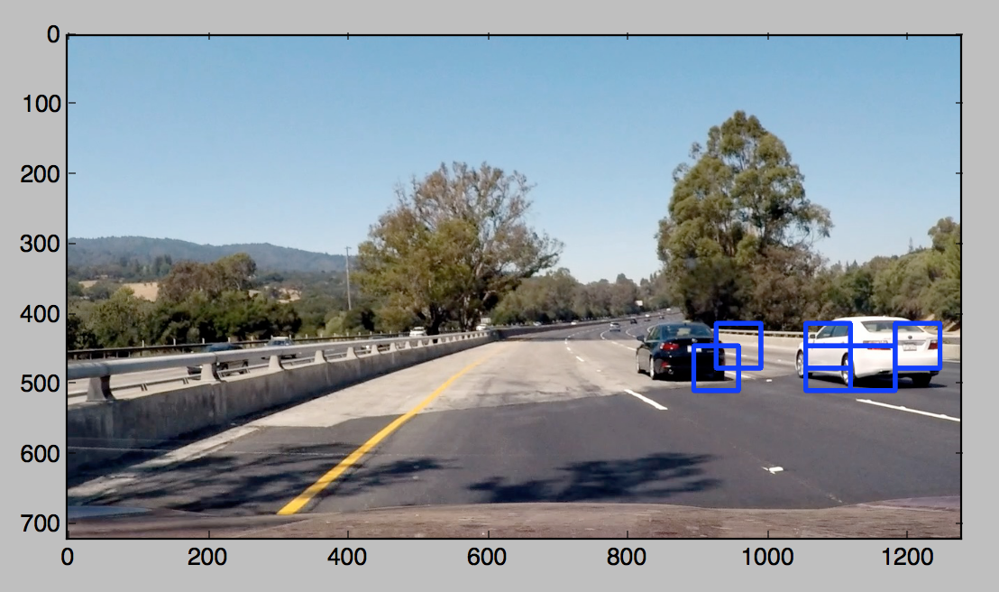
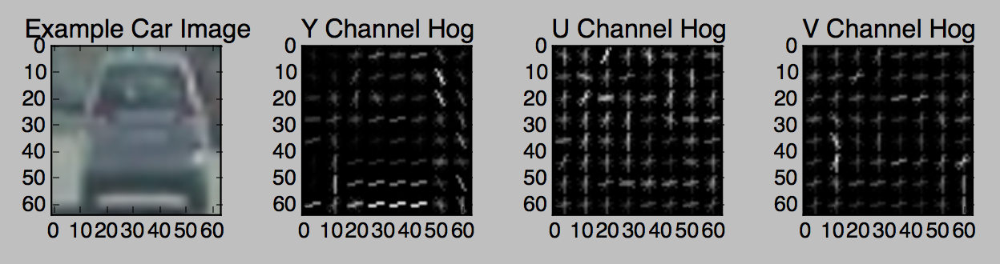
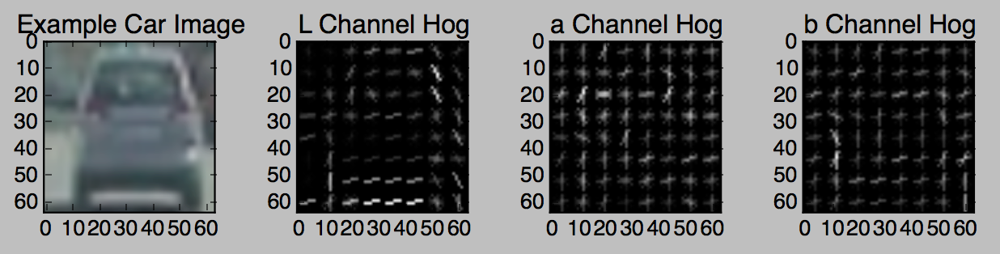
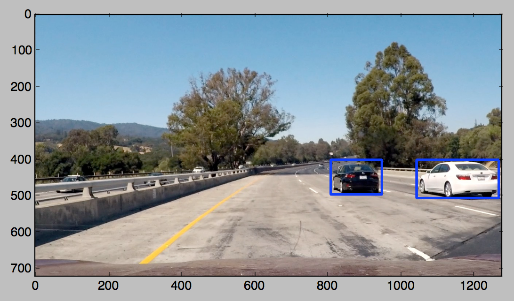
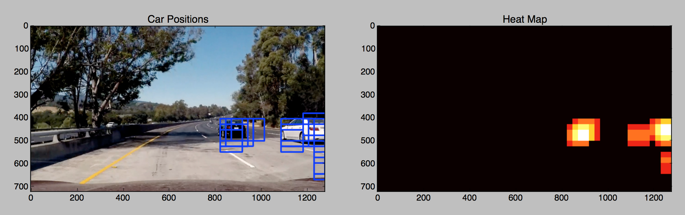

### Vehicle detection project

Each points from the requirements rubric are here described

---

###Writeup / README

####1. Provide a Writeup / README that includes all the rubric points and how you addressed each one. <br>
See the [README.md] of this project

###Histogram of Oriented Gradients (HOG)

####1. Explain how (and identify where in your code) you extracted HOG features from the training images.

The code for this step start at the line 149 of the files `./src/utils.py`. 
The first step was to decide which color space I was going to use. To do this, I ran the classifier trough some test images to check the behavior of the different color spaces: <br>
  * RGB color space

  * YUV color space

  * HSV color space

  * Lab color space

  * LUV color space

  * YCrCb color space



Here, we can see that the YUV, YCrCb and LUV color space all did a pretyy good job identifying the 2 cars. However. YCrCb is the only one to distinctively detect them, but YUV draw more boxes arounf the actual car which will be useful when it comes to detect false-positives with the Heatmap. It is the color-space I am going to use here. 

####2. Explain how you settled on your final choice of HOG parameters.

I tried various combinations of parameters of color space and applied HOG to each channels. Here are the results: <br>
 * HOG applied to RGB channels

  * HOG applied to YUV channels

  * HOG applied to HLS channels

  * HOG applied to HSV channels

  * HOG applied to Lab channels

  * HOG applied to LUV channels

  * HOG applied to YCrCb channels


From the images above, we can see that YUV or YcrCb are good candidates for the color to use. Indeed, each of the channels display enough data to discriminate a car among other objects.

####3. Describe how (and identify where in your code) you trained a classifier using your selected HOG features (and color features if you used them).

Before training the classifier, the dataset has been splitted into training and test set. Doing this, I can safely the the accuracy of the classifier on the test set. I obtain more than 99%. 
```
from sklearn.svm import LinearSVC
svc = LinearSVC()
svc.fit(X_train, y_train)
```
This part of the code can be found at the line 100 of `./src/process.py` in the method `prepare_data()`.

###Sliding Window Search

####1. Describe how (and identify where in your code) you implemented a sliding window search.  How did you decide what scales to search and how much to overlap windows?

A window from a defined size will <i>slide</i> to a defined zone of the frame, looking for vehicles. Here, it is not necessary to look for a vehicle above half of the size of the input images, since it's the sky (in the future, may be there will be some cars there too). We can also see that the vehicle on which the camera is is always driving on the left lane of the road. We can then assume that the vehicle will be detected on the right side of the image. 

The implementation of this window can bee seen from line 234 in the files `./src/utils.py` 

####2. Show some examples of test images to demonstrate how your pipeline is working.  What did you do to optimize the performance of your classifier?

Ultimately I searched on two scales using YCrCb 3-channel HOG features plus spatially binned color and histograms of color in the feature vector, which provided a nice result.  Here is a result on a test image:

---

### Video Implementation

####1. Provide a link to your final video output.  Your pipeline should perform reasonably well on the entire project video (somewhat wobbly or unstable bounding boxes are ok as long as you are identifying the vehicles most of the time with minimal false positives.)
Here's a [link to my video result](./project_video.mp4)


####2. Describe how (and identify where in your code) you implemented some kind of filter for false positives and some method for combining overlapping bounding boxes.

I recorded the positions of positive detections in each frame of the video.  From the positive detections I created a heatmap and then thresholded that map to identify vehicle positions.  I then used `scipy.ndimage.measurements.label()` to identify individual blobs in the heatmap.  I then assumed each blob corresponded to a vehicle.  I constructed bounding boxes to cover the area of each blob detected.  

Here's an example result showing the heatmap from a series of frames of video, the result of `scipy.ndimage.measurements.label()` and the bounding boxes then overlaid on the last frame of video:



---

###Discussion

####1. Briefly discuss any problems / issues you faced in your implementation of this project.  Where will your pipeline likely fail?  What could you do to make it more robust?

First of all, I only check on one part of the frame (the right bottom part), because in this case, the car on which the camera is mounted always drive to the left lane. We could enhanced this by searching a car within the whole half bottom part of the image. This way, the detection of vehicle will not be dependent anymore from the position of the car on which the camera is. <br>
SVM is a ggod classifier, but we need to provide it labeled data. In this project, I extract some features from the image (HOG, color space etc...) to train the classifier, and it was difficult to find the right parameters to get a great precision. What I could d is to use a Deep Convulotionnal Network to better detect cars. Indeed, Convolutionals Layers are able to detect shape by itself, removing the need to extract features before procesing the images.  
